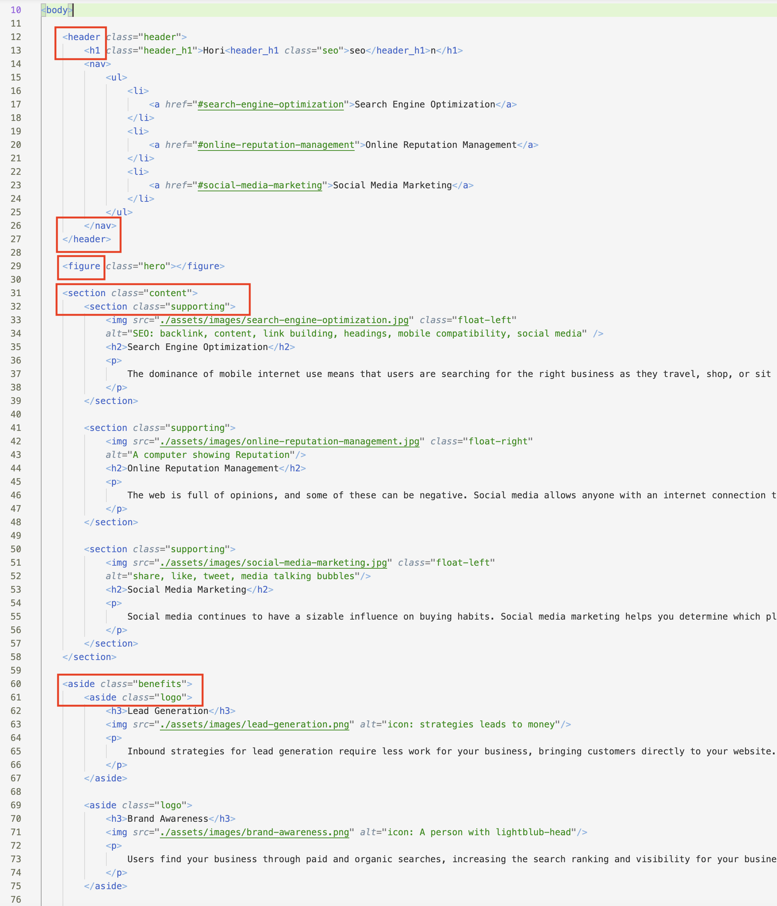
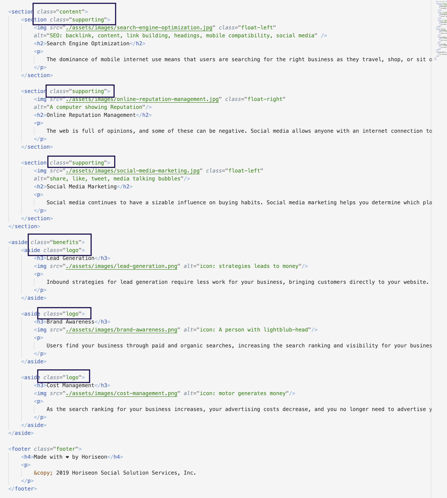
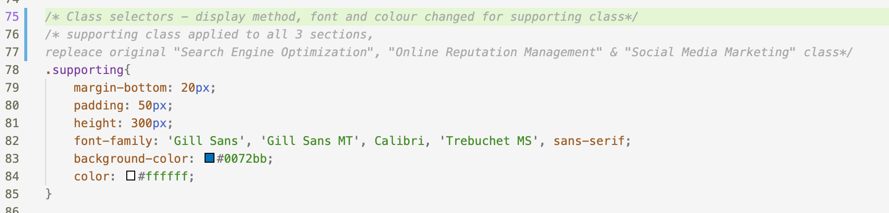
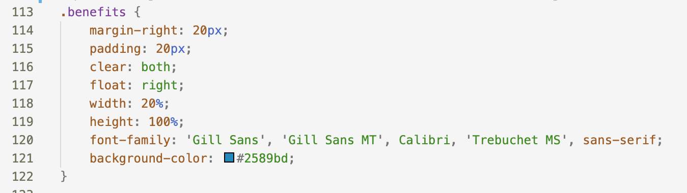
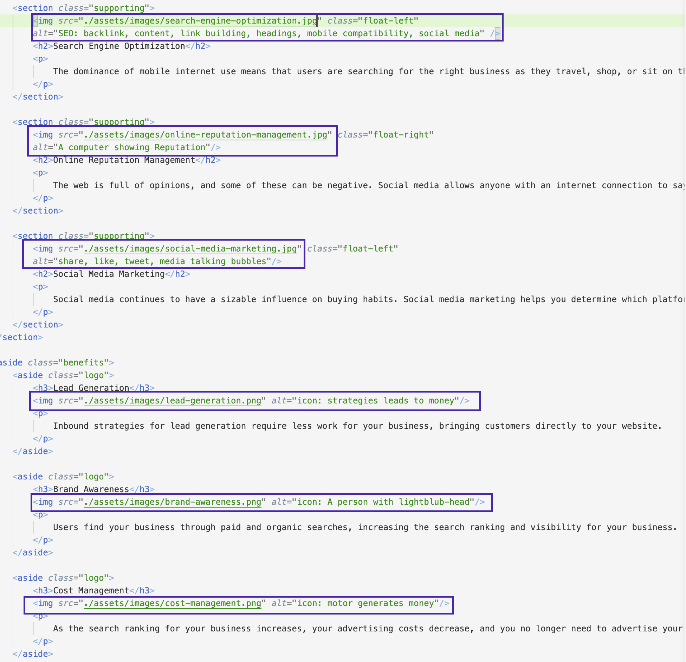
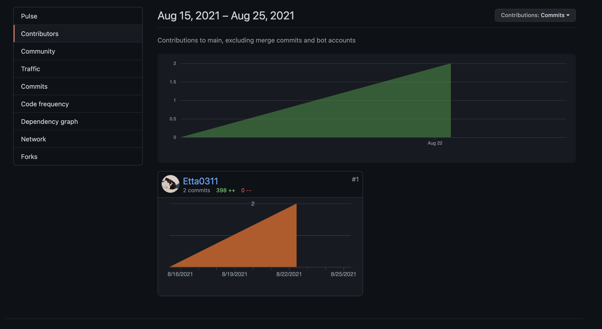

# Homework 01 HTML, CSS, and Git: Code Refactor

## Description

In this task, the starter code of Horiseon website has been provided and the main purpose of the task is to make the code readable to public and other developers.
My work is mainly focused on replacing the code with a clearer structure using different techniques.
This task help me on understand what the elements are semantic or non semantic, also how to apply same properties to multiple sections.
It was a valued oppotunities to have some practical trials on building a logical semantic structure.

## Table of Contents

   - Techniques used
   - Usage
   - Credits
   - License

## Techniques used

   - Elements Such as header, footer, sections, asides etc. in html
   - Images alternative text
   - Class selectors

## Usage

1. Change non semantic to semantic elements

   
 and  are 2 non semantic elements used in original file which does not let the browser to classify the content.
   Using semantic elements will be more readable to browser and so do users and developers.

     

2. Group sections into same class selector

   For sections and asides that share the same properties on displays or text style
   As to make it simplier in css file and easier to search, using the same class can easily applied everything by once.

     

     supporting class in css file
     

     benefits class in css file
     

3. Alternative text for images

    Adding alternative text to image is to make sure viewers will not miss any messages from the images.
    Those text will only show when the images cannot be loaded.
    
     

## Contributors

## Credits
    - https://coding-boot-camp.github.io/full-stack/github/professional-readme-guid
    - https://www.w3schools.com/html/html5_semantic_elements.asp
    - https://choosealicense.com/
    
## License
MIT License

Copyright (c) [2021] [Ettaho]

Permission is hereby granted, free of charge, to any person obtaining a copy
of this software and associated documentation files (the "Software"), to deal
in the Software without restriction, including without limitation the rights
to use, copy, modify, merge, publish, distribute, sublicense, and/or sell
copies of the Software, and to permit persons to whom the Software is
furnished to do so, subject to the following conditions:

The above copyright notice and this permission notice shall be included in all
copies or substantial portions of the Software.

THE SOFTWARE IS PROVIDED "AS IS", WITHOUT WARRANTY OF ANY KIND, EXPRESS OR
IMPLIED, INCLUDING BUT NOT LIMITED TO THE WARRANTIES OF MERCHANTABILITY,
FITNESS FOR A PARTICULAR PURPOSE AND NONINFRINGEMENT. IN NO EVENT SHALL THE
AUTHORS OR COPYRIGHT HOLDERS BE LIABLE FOR ANY CLAIM, DAMAGES OR OTHER
LIABILITY, WHETHER IN AN ACTION OF CONTRACT, TORT OR OTHERWISE, ARISING FROM,
OUT OF OR IN CONNECTION WITH THE SOFTWARE OR THE USE OR OTHER DEALINGS IN THE
SOFTWARE.
